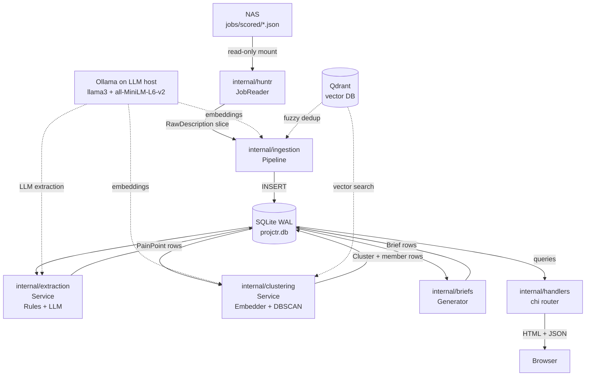

# Projctr — Technical Deep-Dive

**Target audience:** A developer new to the codebase who needs to understand every layer from startup to HTTP response.

**Go module:** `github.com/yourname/projctr` | **Go version:** 1.24.0

---

## Table of Contents

1. [System Overview](#1-system-overview)
2. [Application Bootstrap](#2-application-bootstrap-cmdservermainago)
3. [Configuration System](#3-configuration-system-internalconfig)
4. [Database Layer](#4-database-layer-internaldatabase-internalrepository)
5. [Data Ingestion](#5-data-ingestion-internalhuntr-internalingestion)
6. [Pain Point Extraction](#6-pain-point-extraction-internalextraction)
7. [Semantic Clustering](#7-semantic-clustering-internalclustering)
8. [Brief Generation](#8-brief-generation-internalbriefs)
9. [Post-Ingest Pipeline](#9-post-ingest-pipeline-internalpipeline)
10. [HTTP Layer](#10-http-layer-internalhandlers)
11. [End-to-End Data Flow Diagram](#11-end-to-end-data-flow-diagram)
12. [Key Design Decisions](#12-key-design-decisions)

---

## 1. System Overview

### Purpose and Problem Being Solved

Projctr answers the question: "What portfolio projects should I build to make myself more hirable?"

The input is a set of job descriptions that Huntr (a job-tracking application) has already scored against a CV. Jobs that score *below* a configured threshold are "sub-threshold" — they reveal skill gaps. Projctr reads those descriptions, extracts the concrete technical requirements they express as pain points, groups similar requirements together into clusters, and generates actionable project briefs from each cluster.

The result is a prioritised list of project ideas derived from real job market signal rather than guesswork.

### High-Level Architecture Diagram



Dashed lines indicate optional integrations that degrade gracefully when unavailable.

### Technology Stack

| Layer | Technology | Role |
|---|---|---|
| Language | Go 1.24.0 | Entire application |
| HTTP router | `github.com/go-chi/chi/v5` | Routing, path params |
| Database | SQLite via `modernc.org/sqlite` | Persistent store (pure-Go driver) |
| Config | `github.com/BurntSushi/toml` | TOML config file parsing |
| Embeddings | Ollama `all-MiniLM-L6-v2` (384d) | Vector embeddings for clustering |
| LLM extraction | Ollama `llama3` on LLM host | Optional structured extraction |
| Vector DB | Qdrant (gRPC) | Fuzzy deduplication of descriptions |

### Infrastructure Map

| Host | Role | Key mounts / services |
|---|---|---|
| **The Raspberry Pi** | Production target | Runs Projctr as systemd service; mounts NAS at `/mnt/nas/huntr-data/jobs/scored/` |
| **The LLM host** | ML host on local network | Runs Ollama; hosts extraction LLM (`[extraction.llm]`) and `all-MiniLM-L6-v2` (embeddings) |
| **Francis** | High-powered LLM host (RTX 5060Ti) | Runs Ollama with `mixtral:latest`; used for brief generation and on-demand refinement via `[trackr.llm]`; optional — gracefully degraded when offline |
| **NAS** | File storage | Holds Huntr's `jobs_scored_*.json` snapshot files; read-only from the Raspberry Pi |
| **Qdrant** | Vector database | Runs as Docker container (local dev) or sidecar; optional for production |

---

## 2. Application Bootstrap (`cmd/server/main.go`)

`main()` follows a strict linear startup sequence. Each step either succeeds and continues, or calls `log.Fatalf` to abort (except optional services which log a warning and continue with a nil pointer).

### Startup Sequence

```
1. Resolve config path  →  CONFIG_PATH env or default "config.toml"
2. config.Load()        →  Parse TOML, apply env overrides
3. database.Open()      →  Open SQLite WAL connection (fatal on error)
4. database.Migrate()   →  Apply schema idempotently (fatal on error)
5. Build repositories   →  DescriptionStore, PainPointStore, ClusterStore, BriefStore
6. Build JobReader       →  huntr.NewJobReader(jobsPath, scoreThreshold)
7. Build Embedder        →  clustering.NewEmbedder(model, endpoint)
8. Connect Qdrant        →  vectordb.New(cfg.Qdrant) — WARNING + nil if unreachable
9. Build ingestion.Pipeline  →  struct literal with optional Qdrant + Embedder
10. Build RulesExtractor →  loads tech-dict.toml (fatal if missing)
11. Build LLMExtractor   →  only if cfg.Extraction.LLM.Enabled (nil pointer when disabled)
12. Build extraction.Service →  wraps mode + both extractors
13. Build DBSCAN         →  clustering.NewDBSCAN(minPts, 1 - similarityThreshold)
14. Build clustering.Service →  wraps DBSCAN + Embedder + stores
15. Build briefs.Generator   →  stateless, no deps
16. Build pipeline.Service   →  full pipeline: extract → cluster → brief
17. Build chi.Router     →  handlers.Register(r, deps)
18. http.ListenAndServe  →  blocks forever on host:port
```

### Graceful Degradation

The application has two optional external services:

**Qdrant (fuzzy dedup):**
```go
var qdrantClient *vectordb.Client
if qc, err := vectordb.New(cfg.Qdrant); err == nil {
    qdrantClient = qc
} else {
    log.Printf("Qdrant unavailable (fuzzy dedup disabled): %v", err)
}
```
If `vectordb.New` fails, `qdrantClient` stays `nil`. The ingestion pipeline checks `p.Qdrant != nil` before attempting fuzzy dedup, so it silently runs in exact-hash-only mode.

**Ollama LLM (extraction):**
```go
var llmExt *extraction.LLMExtractor
if cfg.Extraction.LLM.Enabled {
    llmExt = extraction.NewLLMExtractor(...)
}
```
If LLM is disabled in config, `llmExt` is `nil`. The extraction service accepts a nil `LLMExtractor` and skips LLM calls. Even when enabled, if Ollama is unreachable at extraction time, `LLMExtractor.Extract` returns `(nil, nil)` — no error propagated.

---

## 3. Configuration System (`internal/config/`)

### Config Struct Hierarchy

`config.Load(path string) (*Config, error)` reads a TOML file via `toml.Decode` then applies environment variable overrides. The full struct tree:

```go
type Config struct {
    Server     ServerConfig
    Database   DatabaseConfig
    Huntr      HuntrConfig
    ChromaDB   ChromaDBConfig   // present in struct but not actively used
    Qdrant     QdrantConfig
    Embedding  EmbeddingConfig
    Extraction ExtractionConfig
    Clustering ClusteringConfig
    Ingestion  IngestionConfig
}
```

### Key Fields and Their Effects

| Section | Field | Default (config.toml) | Effect |
|---|---|---|---|
| `[server]` | `port` | `"8090"` | `host:port` passed to `http.ListenAndServe` |
| `[server]` | `host` | `"0.0.0.0"` | Binds to all interfaces |
| `[database]` | `path` | `"./projctr.db"` | SQLite file location |
| `[huntr]` | `jobs_path` | `/mnt/nas/huntr-data/jobs/scored` | Directory containing `jobs_scored_*.json` files |
| `[huntr]` | `score_threshold` | `300` | Jobs with score >= 300 are ignored (not sub-threshold) |
| `[qdrant]` | `host`, `port` | `localhost:6334` | Qdrant gRPC endpoint |
| `[qdrant]` | `description_collection` | `projctr_descriptions` | Collection for description fuzzy dedup |
| `[qdrant]` | `vector_dimensions` | `384` | Must match all-MiniLM-L6-v2 output |
| `[embedding]` | `model` | `sentence-transformers/all-MiniLM-L6-v2` | Ollama model name |
| `[embedding]` | `endpoint` | `http://localhost:11434/api/embeddings` | Ollama embeddings endpoint |
| `[extraction]` | `mode` | `"both"` | `"rules"`, `"llm"`, or `"both"` |
| `[extraction]` | `tech_dictionary` | `./config/tech-dict.toml` | Path to technology keyword dictionary |
| `[extraction.llm]` | `enabled` | `true` | Gates LLMExtractor creation at startup |
| `[extraction.llm]` | `endpoint` | `http://<LLM_HOST>:11434` | The LLM host's Ollama API |
| `[extraction.llm]` | `model` | `llama3` | Ollama model for extraction |
| `[clustering]` | `min_cluster_size` | `3` | DBSCAN minPts — minimum points to form a cluster |
| `[clustering]` | `similarity_threshold` | `0.65` | Converted to epsilon = `1 - 0.65 = 0.35` for DBSCAN |

### Environment Variable Overrides

Only two env vars are implemented in `config.Load`:

| Env Var | Overrides |
|---|---|
| `CONFIG_PATH` | Path to config file (handled in `main`, not `config.Load`) |
| `HUNTR_JOBS_PATH` | `cfg.Huntr.JobsPath` |
| `CHROMADB_URL` | `cfg.ChromaDB.URL` |

`DATABASE_PATH` is mentioned in CLAUDE.md as an intended override but is not currently implemented in `config.Load`.

### Config Flow

```
config.toml (disk)
    → toml.Decode → Config struct
    → env overrides applied
    → passed to main()
    → fields extracted and passed as constructor args to each service
```

Config is not passed as a global or context value. Each service receives only the fields it needs (e.g., `cfg.Embedding.Model` and `cfg.Embedding.Endpoint` go to `clustering.NewEmbedder`).

---

## 4. Database Layer (`internal/database/`, `internal/repository/`)

### Opening the Database

`database.Open(path string) (*sql.DB, error)` appends `?_journal_mode=WAL` to the DSN before calling `sql.Open("sqlite", ...)`. This enables Write-Ahead Logging mode at the connection level.

WAL mode benefits for this use case:
- Concurrent reads do not block writes. The HTTP dashboard can serve briefs while the post-ingest pipeline is writing pain points.
- Reads always see a consistent snapshot; no read-lock required.
- Better write performance on Raspberry Pi's SD card: WAL appends sequentially rather than modifying the main database file in-place.

### Schema — All 8 Tables

#### `descriptions`
The raw ingested job descriptions. One row per unique job posting.

```sql
CREATE TABLE IF NOT EXISTS descriptions (
    id            INTEGER PRIMARY KEY AUTOINCREMENT,
    huntr_id      TEXT NOT NULL,          -- job URL (used as unique key)
    role_title    TEXT,
    sector        TEXT,                   -- NOTE: holds company name (Huntr mapping)
    salary_min    INTEGER,
    salary_max    INTEGER,
    location      TEXT,
    source_board  TEXT,
    huntr_score   REAL,
    raw_text      TEXT NOT NULL,          -- full job description text
    date_scraped  DATETIME,              -- may be NULL (not parsed from filename yet)
    date_ingested DATETIME NOT NULL,
    content_hash  TEXT NOT NULL,          -- SHA-256 of normalised raw_text
    UNIQUE(huntr_id)
)
```

#### `pain_points`
Structured requirements extracted from each description.

```sql
CREATE TABLE IF NOT EXISTS pain_points (
    id              INTEGER PRIMARY KEY AUTOINCREMENT,
    description_id  INTEGER NOT NULL REFERENCES descriptions(id),
    challenge_text  TEXT NOT NULL,   -- the requirement sentence
    domain          TEXT,            -- language|framework|platform|tool|database|methodology|general
    outcome_text    TEXT,            -- business outcome phrase (may be empty)
    confidence      REAL,            -- 0.4 / 0.6 / 0.9 from rules; 0.0-1.0 from LLM
    qdrant_point_id TEXT,            -- UUID in Qdrant (set when vector stored)
    date_extracted  DATETIME NOT NULL
)
```

#### `technologies`
Canonical technology names discovered across all pain points.

```sql
CREATE TABLE IF NOT EXISTS technologies (
    id       INTEGER PRIMARY KEY AUTOINCREMENT,
    name     TEXT NOT NULL UNIQUE,
    category TEXT              -- language|framework|platform|tool|database|methodology
)
```

#### `pain_point_technologies`
Many-to-many join between pain points and technologies.

```sql
CREATE TABLE IF NOT EXISTS pain_point_technologies (
    pain_point_id INTEGER NOT NULL REFERENCES pain_points(id),
    technology_id INTEGER NOT NULL REFERENCES technologies(id),
    PRIMARY KEY (pain_point_id, technology_id)
)
```

#### `clusters`
A group of semantically similar pain points.

```sql
CREATE TABLE IF NOT EXISTS clusters (
    id             INTEGER PRIMARY KEY AUTOINCREMENT,
    summary        TEXT NOT NULL,        -- "[Domain] <best challenge text, truncated to 200 chars>"
    frequency      INTEGER NOT NULL DEFAULT 0,  -- number of member pain points
    avg_salary     REAL,                 -- reserved; not yet populated
    recency_score  REAL,                 -- 0.0-1.0; average freshness of members
    gap_type       TEXT,                 -- skill_extension|skill_acquisition|domain_expansion|mixed
    gap_score      REAL,                 -- reserved; copied from GapScore (nil in current impl)
    date_clustered DATETIME NOT NULL
)
```

#### `cluster_members`
Associates pain points with their cluster.

```sql
CREATE TABLE IF NOT EXISTS cluster_members (
    cluster_id    INTEGER NOT NULL REFERENCES clusters(id),
    pain_point_id INTEGER NOT NULL REFERENCES pain_points(id),
    PRIMARY KEY (cluster_id, pain_point_id)
)
```

#### `briefs`
Generated project briefs. One per cluster (enforced via `ListWithoutBriefs`).

```sql
CREATE TABLE IF NOT EXISTS briefs (
    id                 INTEGER PRIMARY KEY AUTOINCREMENT,
    cluster_id         INTEGER NOT NULL REFERENCES clusters(id),
    source_company     TEXT NOT NULL DEFAULT '',   -- added via ALTER TABLE
    source_role        TEXT NOT NULL DEFAULT '',   -- added via ALTER TABLE
    title              TEXT NOT NULL,
    problem_statement  TEXT,
    suggested_approach TEXT,
    technology_stack   TEXT,       -- JSON array string e.g. '["Go","REST API","SQLite"]'
    project_layout     TEXT,       -- Markdown string with directory structure
    complexity         TEXT,       -- small|medium|large
    impact_score       REAL,
    linkedin_angle     TEXT,
    is_edited          INTEGER NOT NULL DEFAULT 0,   -- SQLite boolean: 0/1
    date_generated     DATETIME NOT NULL,
    date_modified      DATETIME
)
```

#### `projects`
Tracks a brief through the portfolio pipeline lifecycle. Not yet populated by any current code path — reserved for future UI.

```sql
CREATE TABLE IF NOT EXISTS projects (
    id             INTEGER PRIMARY KEY AUTOINCREMENT,
    brief_id       INTEGER NOT NULL REFERENCES briefs(id),
    stage          TEXT NOT NULL,    -- candidate|selected|in_progress|complete|published|archived
    repository_url TEXT,
    linkedin_url   TEXT,
    notes          TEXT,
    date_created   DATETIME NOT NULL,
    date_selected  DATETIME,
    date_started   DATETIME,
    date_completed DATETIME,
    date_published DATETIME
)
```

### Index Strategy

| Index | Column(s) | Reason |
|---|---|---|
| `idx_descriptions_content_hash` | `descriptions(content_hash)` | O(1) exact dedup check per ingest |
| `idx_descriptions_date_ingested` | `descriptions(date_ingested)` | Ordered queries for `ListUnextracted` |
| `idx_pain_points_description_id` | `pain_points(description_id)` | Fast join in `ListUnextracted` and `ListUnassigned` |

### Idempotent Migrations

`database.Migrate(db)` uses `CREATE TABLE IF NOT EXISTS` for all tables and `CREATE INDEX IF NOT EXISTS` for all indexes, making it safe to call on every startup. Two columns added after the initial schema were added with `ALTER TABLE ... ADD COLUMN` with errors silently ignored:

```go
_, _ = db.Exec(`ALTER TABLE briefs ADD COLUMN project_layout TEXT`)
_, _ = db.Exec(`ALTER TABLE briefs ADD COLUMN source_company TEXT NOT NULL DEFAULT ''`)
_, _ = db.Exec(`ALTER TABLE briefs ADD COLUMN source_role TEXT NOT NULL DEFAULT ''`)
```

This pattern handles the case where the column already exists (SQLite returns an error, which is discarded).

### Repository Pattern

Each store is a thin wrapper around `*sql.DB` exposing domain-specific methods. No ORM is used.

#### `DescriptionStore`
| Method | SQL Pattern |
|---|---|
| `HasContentHash(hash)` | `SELECT 1 FROM descriptions WHERE content_hash = ?` |
| `Insert(d)` | `INSERT INTO descriptions ...` returns `LastInsertId()` |
| `Count()` | `SELECT COUNT(*)` |
| `ListUnextracted()` | `LEFT JOIN pain_points WHERE p.id IS NULL` — descriptions with no extracted pain points |
| `GetByID(id)` | `SELECT ... WHERE id = ?` |

#### `PainPointStore`
| Method | SQL Pattern |
|---|---|
| `Insert(p)` | `INSERT INTO pain_points ...` |
| `InsertTechnology(t)` | `INSERT OR IGNORE INTO technologies ...` then `SELECT id` |
| `LinkTechnology(ppID, techID)` | `INSERT OR IGNORE INTO pain_point_technologies ...` |
| `ListAll()` | Full scan ordered by `date_extracted DESC` |
| `ListByDescriptionID(id)` | Filtered by `description_id` |
| `ListUnassigned()` | `LEFT JOIN cluster_members WHERE cm.pain_point_id IS NULL` |
| `Count()` | `SELECT COUNT(*)` |

#### `ClusterStore`
| Method | SQL Pattern |
|---|---|
| `GetByID(id)` | Single row lookup |
| `List()` | Full scan ordered by `date_clustered DESC` |
| `Insert(c)` | `INSERT INTO clusters ...` |
| `InsertMember(clusterID, ppID)` | `INSERT OR IGNORE INTO cluster_members ...` |
| `Count()` | `SELECT COUNT(*)` |
| `ListWithoutBriefs()` | `LEFT JOIN briefs WHERE b.id IS NULL` — clusters with no brief yet |

#### `BriefStore`
| Method | SQL Pattern |
|---|---|
| `Insert(b)` | `INSERT INTO briefs ...` |
| `List()` | Full scan ordered by `date_generated DESC` |
| `GetByID(id)` | Single row lookup |

All nullable `float64` columns are handled via `sql.NullFloat64`; nullable timestamps via `sql.NullTime`. The helpers `timeToNull`, `float64ToNull`, `boolToInt`, and `nullableString` handle Go ↔ SQLite type conversions at the repository boundary.

---

## 5. Data Ingestion (`internal/huntr/`, `internal/ingestion/`)

### File Discovery

`JobReader.listScoredFiles()` reads the configured `jobs_path` directory and returns all files whose names match `jobs_scored_*.json`. Files are sorted in reverse lexicographic order (newest first) using:

```go
sort.Slice(files, func(i, j int) bool {
    return files[i] > files[j]
})
```

This relies on Huntr naming files with an ISO-format date stamp (e.g., `jobs_scored_20260311.json`), so lexicographic descending == chronological descending.

### The NaN Fix

Huntr writes JavaScript's `NaN` literal for missing numeric fields such as `salary_num`:

```json
{"title": "SWE", "salary_num": NaN, ...}
```

Go's `encoding/json` does not accept `NaN` as a valid JSON value and would return a parse error. The reader pre-processes raw bytes before unmarshaling:

```go
data = []byte(strings.ReplaceAll(string(data), ": NaN", ": null"))
data = []byte(strings.ReplaceAll(string(data), ":NaN", ":null"))
```

Both the spaced and un-spaced forms are replaced. After substitution, `json.Unmarshal` sees `null`, which correctly maps to Go's zero value for `float64`.

### File-level Deduplication by Link

After reading all files, `FetchSubThreshold` deduplicates within the in-memory batch using the job's `Link` field (the URL):

```go
key := j.Link
if key == "" {
    key = j.Title + "|" + j.Company
}
if seen[key] {
    continue
}
```

This prevents the same job appearing in multiple snapshot files from being ingested twice.

### Score Filtering

Only jobs with `Score < scoreThreshold` (default 300) are kept. Jobs at or above the threshold are considered "good fits" and are excluded — Projctr is only interested in the gaps.

### Field Mapping: ScoredJob → RawDescription → Description

Huntr's JSON field `company` maps to `RawDescription.Sector` (and then `Description.Sector`). This is noted in a comment in `briefs.go`: "Sector holds the company name (Huntr's mapping)."

`SalaryNum` from Huntr is a single value; it is mapped to both `SalaryMin` and `SalaryMax` as a `*int`.

### Two-Stage Deduplication in the Pipeline

`ingestion.Pipeline.Run()` implements two deduplication checks for each candidate description:

**Stage 1 — Exact content hash:**
```go
hash := ContentHash(r.RawText)   // SHA-256 of lowercase, whitespace-normalised text
exists, err := p.Store.HasContentHash(hash)
if exists { skipped++; continue }
```

`ContentHash` lowercases the text and collapses all whitespace runs to single spaces before hashing. This means the same description posted with slightly different whitespace is still deduplicated.

**Stage 2 — Fuzzy vector similarity (optional):**
```go
useFuzzy := p.Embedder != nil && p.Embedder.Ready() && p.Qdrant != nil
if useFuzzy {
    vec, _ = p.Embedder.Embed(r.RawText)
    similar, _ = p.Qdrant.IsSimilarDescription(ctx, vec)
    if similar { skipped++; continue }
}
```

Only runs when both the Embedder endpoint is configured and a Qdrant client was successfully created at startup. `IsSimilarDescription` performs a cosine similarity search against the `description_collection` in Qdrant with a threshold of 0.95 (as noted in `dedup.go`'s comment). If Qdrant is unavailable, this entire stage is skipped without error.

After passing both checks, a new `models.Description` is inserted. If fuzzy dedup is active, the embedding vector is also upserted into Qdrant for future comparisons:

```go
_ = p.Qdrant.UpsertDescription(ctx, id, vec)
```

The `Result` struct returned by `Run` carries `Ingested` and `Skipped` counts displayed in the dashboard.

---

## 6. Pain Point Extraction (`internal/extraction/`)

### NormaliseTech()

`NormaliseTech(raw string, dict []TechEntry) string` maps a raw technology string to its canonical name using the `tech-dict.toml` dictionary. Matching is case-insensitive, exact-match on variants:

```go
for _, entry := range dict {
    for _, v := range entry.Variants {
        if strings.ToLower(v) == lower {
            return entry.Canonical
        }
    }
}
return raw  // unchanged if no match
```

Example: `"JS"`, `"javascript"`, `"node.js"` all map to `"JavaScript"` if configured in `tech-dict.toml`.

`findTechsInText(text string, dict []TechEntry)` is the broader scanner used during extraction. It applies two matching strategies per entry:

1. **Multi-word variants** (variants containing a space): substring match on the full lowercased text.
2. **Single-token variants**: exact match against tokens produced by `tokenise()`, which splits on anything that is not a letter, digit, `+`, `#`, or `.` — preserving language names like `C++`, `C#`, and `Node.js`.

The `seen` map prevents the same canonical tech appearing twice from different variant matches.

### RulesExtractor

`NewRulesExtractor(dictPath string)` loads `tech-dict.toml` via `toml.DecodeFile` into a `[]TechEntry`.

`Extract(rawText string)` processes the text sentence by sentence:

**Step 1 — Sentence splitting:**
`splitSentences` splits on `\n`, `;`, and `.` followed by whitespace. It iterates rune-by-rune and handles the edge case of `.` mid-word (e.g., `Node.js`) by only splitting on `.` when the next character is a space or newline.

**Step 2 — Trigger phrase detection:**
Each sentence is checked against 26 trigger phrases:

```go
var triggerPhrases = []string{
    "experience with", "experience in", "proficiency in", "knowledge of",
    "familiarity with", "understanding of", "expertise in", "strong background in",
    "hands-on experience", "deep understanding", "must have", "required",
    "essential", "you will need", "we require", "we are looking for",
    "you should have", "you must have", "we expect", "proven experience",
    "solid understanding", "working knowledge", "comfortable with",
    "demonstrable experience", "track record",
}
```

**Step 3 — Tech scanning:** `findTechsInText` scans the sentence for any dictionary matches.

**Step 4 — Confidence scoring:**

| Condition | Confidence |
|---|---|
| Tech found only (no trigger phrase) | `0.4` |
| Trigger phrase only (no tech found) | `0.6` |
| Both trigger phrase AND tech found | `0.9` |

Sentences with neither a trigger phrase nor a tech match are dropped entirely.

**Step 5 — Domain assignment:**
`domain` is set to the `Category` field of the first matched tech entry (e.g., `"framework"`, `"language"`). Defaults to `"general"` if no tech was found.

**Step 6 — Outcome extraction:**
`extractOutcome(lower string)` looks for intent phrases (`"to enable"`, `"to support"`, `"to improve"`, `"in order to"`, `"to help"`, `"to build"`, `"to deliver"`) and returns up to 80 characters starting from the match index.

**Step 7 — Within-description deduplication:**
A `seen` map keyed by either the canonical name of the first matched tech, or the first 30 characters of the lowercased sentence (for tech-free sentences). When two sentences resolve to the same key, the higher-confidence entry wins:

```go
if existing, ok := seen[key]; !ok || pp.Confidence > existing.Confidence {
    seen[key] = pp
}
```

### LLMExtractor

`LLMExtractor.Extract(rawText string)` sends a structured prompt to Ollama's `/api/generate` endpoint (on the LLM host by default).

**Text truncation:** Input is capped at 3,000 characters to keep latency and token usage reasonable.

**Prompt design (three-stage reasoning):**

The prompt instructs the model to work through three internal steps before writing output:

```
You are a senior systems architect reviewing a job description to identify latent
engineering challenges.

Work through three steps internally before writing output:

Step 1 — Extract signals: identify the tech stack, core responsibilities, implicit
constraints, and anything the role needs to handle but does not explicitly name.

Step 2 — Infer problems: for each responsibility, ask "what engineering problem does
this actually require solving?" Focus on system design, scalability, reliability,
and integration challenges — not skills lists.

Step 3 — Reframe as project ideas: turn each inferred problem into a concrete,
buildable project a developer could complete to demonstrate mastery.

Output rules:
- challenge_text must describe a specific engineering problem to solve, written as
  "Build a..." or "Create a..." — NEVER repeat the job requirement verbatim
- Penalise resume language: "experience with X" or "familiarity with Y" are NOT
  valid challenge_text values
- Prefer latent problems over obvious ones
- Ignore soft skills, degree requirements, and generic requirements
```

This framing produces `challenge_text` values like "Build a distributed fare validation API that maintains sub-100ms latency under peak commuter load" rather than "Experience with high-throughput APIs".

**JSON extraction from response:**
`extractJSONArray(s string)` handles two LLM response formats:
1. Markdown-fenced code block: strips the ` ``` ` fence and content before the first newline.
2. Raw JSON: finds the outermost `[` and `]` boundaries.

**Graceful failure:** If the HTTP request fails, the response is unparseable, or no JSON array is found, `Extract` returns `(nil, nil)` — not an error. The caller in `extraction.Service` handles `nil` results without breaking.

**Post-processing:** `normaliseDomain` validates the LLM's domain string against a whitelist and defaults to `"general"` for invalid values. `clampConfidence` clamps the LLM's confidence float to `[0.0, 1.0]`.

### extraction.Service

`Service.Extract(rawText string)` implements three strategies controlled by `Mode`:

**`"rules"`:** Calls `RulesExtractor.Extract` only.

**`"llm"`:** Calls `LLMExtractor.Extract`; if it returns no results or fails, falls back to rules.

**`"both"`:** Runs both extractors independently, then calls `mergePainPoints`.

**Merge strategy in "both" mode:**
`mergePainPoints(rules, llm []models.PainPoint)` deduplicates by a 20-character prefix of the lowercased `ChallengeText`:

```go
func dedupeKey(text string) string {
    lower := strings.ToLower(strings.TrimSpace(text))
    if len(lower) > 20 { return lower[:20] }
    return lower
}
```

Rules are added first, then LLM points. When two entries share the same key, the higher-confidence entry replaces the lower-confidence one. This means if the LLM produces a higher-confidence version of a sentence the rules extractor also found, the LLM version wins.

`ExtractTechnologies(text string)` delegates to `RulesExtractor.ExtractTechnologies`, returning `[]models.Technology` for the pipeline to store in the `technologies` and `pain_point_technologies` tables.

---

## 7. Semantic Clustering (`internal/clustering/`)

### Embedder

`Embedder` calls Ollama's `/api/embeddings` endpoint (the same endpoint Huntr uses) with the `all-MiniLM-L6-v2` model producing 384-dimensional vectors.

`Embed(text string)` makes a single HTTP POST:
```go
body = {"model": "sentence-transformers/all-MiniLM-L6-v2", "prompt": text}
response = {"embedding": [0.123, -0.456, ...]}  // 384 float64 values
```

The response `[]float64` is converted to `[]float32` to halve memory usage (384 × 4 bytes = 1.5 KB per vector).

`EmbedBatch(texts []string)` calls `Embed` sequentially (no batching at the API level). This is deliberate simplicity: Ollama processes one request at a time anyway on typical hardware.

`Ready()` returns `true` if `endpoint != ""`. It does not probe the actual endpoint.

### DBSCAN Implementation

DBSCAN (Density-Based Spatial Clustering of Applications with Noise) is implemented from scratch in `dbscan.go`. The key parameters:

- **epsilon**: The maximum distance between two points for one to be considered a neighbour of the other. Derived as `1.0 - similarity_threshold` = `1.0 - 0.65 = 0.35` at default config.
- **minPts**: The minimum number of points required to form a dense region. Default: `3`.

**Distance metric:** Cosine distance = `1 - cosine_similarity(a, b)`. Implemented as:

```go
func cosineDistance(a, b []float32) float64 {
    var dot, normA, normB float64
    for i := range a {
        ai, bi := float64(a[i]), float64(b[i])
        dot += ai * bi; normA += ai * ai; normB += bi * bi
    }
    sim := dot / (math.Sqrt(normA) * math.Sqrt(normB))
    // clamp to [-1, 1] to handle float drift
    return 1.0 - sim
}
```

**Algorithm walkthrough:**

1. Precompute the full `n × n` pairwise cosine distance matrix (O(n²) time and space).
2. Initialise all labels to `-1` (noise).
3. For each unvisited point `i`:
   a. Find `neighbours` = all points within `epsilon` distance.
   b. If `len(neighbours) < minPts`: leave as noise.
   c. Otherwise: assign `clusterID` to `i`, create a seed set from `neighbours`.
   d. For each point `q` in the seed set: visit it, expand its neighbourhood if it also has `>= minPts` neighbours, assign it to `clusterID`.
4. Increment `clusterID` and continue.

**Dataset cap:** If `n > 5000`, `Run` returns `(nil, nil)`, triggering the domain-grouping fallback. This protects the Raspberry Pi's limited RAM from a 5000 × 5000 × 8-byte matrix (200 MB).

Points labelled `-1` are noise and are not assigned to any cluster.

### Domain Grouping Fallback

When the Embedder is not ready, DBSCAN returns nil, or the dataset is too large, `domainGroupLabels` is used instead:

```go
func domainGroupLabels(points []*models.PainPoint) []int {
    domains := map[string]int{}
    labels := make([]int, len(points))
    nextID := 0
    for i, p := range points {
        d := p.Domain
        if d == "" { d = "general" }
        if id, ok := domains[d]; ok {
            labels[i] = id
        } else {
            domains[d] = nextID
            labels[i] = nextID
            nextID++
        }
    }
    return labels
}
```

All pain points sharing the same `domain` string receive the same cluster label. This is a deterministic O(n) fallback that sacrifices semantic accuracy for resilience — every pain point gets assigned to a cluster rather than potentially being labelled as noise.

### clustering.Service.Cluster()

Full flow:

```
1. PainPoints.ListUnassigned()         → pain points not in cluster_members
2. if Embedder.Ready():
     EmbedBatch(challengeTexts)        → [][]float32 (one per pain point)
     DBSCAN.Run(vectors)               → []int labels
     if DBSCAN failed:
         domainGroupLabels(points)
   else:
     domainGroupLabels(points)
3. persistClusters(points, labels)
```

`persistClusters` groups point indices by label (skipping noise, label `-1`), then for each group calls `buildCluster` to derive a `models.Cluster`, inserts it, and inserts each member via `Clusters.InsertMember`.

### Cluster Derivation in buildCluster

**Summary:** The challenge text of the highest-confidence pain point in the group, truncated to 200 characters, prefixed with `"[Domain] "` where Domain is the `strings.Title`-cased most-common domain in the group:
```go
fmt.Sprintf("[%s] %s", strings.Title(topDomain), s)
```

**Recency score:** Each point's age in days is capped at 90. Recency = `(90 - age) / 90`, giving 1.0 for points extracted today and 0.0 for points 90+ days old. The cluster's `RecencyScore` is the mean across all members.

**gap_type derivation:**
```go
func domainToGapType(domain string) string {
    switch domain {
    case "language", "framework":   return "skill_extension"
    case "platform", "tool":        return "skill_acquisition"
    case "database", "methodology": return "domain_expansion"
    default:                        return "mixed"
    }
}
```

`gap_score` and `avg_salary` are left as `nil` in the current implementation (reserved fields).

---

## 8. Brief Generation (`internal/briefs/`)

`Generator` holds a cluster store reference and an optional `*briefLLMClient` pointing at Francis (the high-powered Ollama host). Two constructors exist:

- `NewGenerator(clusters)` — rule-based only; used when `[trackr.llm]` is not configured.
- `NewGeneratorWithLLM(clusters, source, endpoint, model)` — wires the LLM client; `source` is `"local_llm"` when inheriting from `[extraction.llm]` or `"francis"` when using `[trackr.llm]` directly.

### GenerateFromCluster

Rule-based values are computed first as defaults, then overwritten by the LLM draft if one is returned:

```
1. deriveTechStack       → reads actual technology names from the cluster's pain points;
                           falls back to gap_type-based templates if none found
2. deriveComplexity      → frequency-based: <5 = small, >=5 = medium, >=10 = large
3. buildProjectLayout    → fixed template per complexity
4. deriveApproach        → first 3 pain point sentences with "Core build / Extend / Integrate" labels
5. deriveLinkedInAngle   → template: "X companies hiring for Y — proves capability with Z"
6. [LLM path] llm.refine → passes pain point challenge_text, tech names, source roles, gap_type,
                           and frequency to Francis; returns title, problem_statement,
                           suggested_approach, linkedin_angle, difficulty_level, portfolio_value
7. Map LLM fields        → difficulty_level → complexity (beginner/intermediate/advanced → small/medium/large)
8. Set generation_source → "rules", "local_llm", or "francis"
```

**Graceful fallback:** If the LLM client is nil or Francis is unreachable (5-second dial timeout), the brief is generated from the rule-based values. The generation completes without error.

### LLM Prompt Design (Francis / mixtral)

The Francis prompt instructs `mixtral:latest` as a **senior systems architect**, not a content writer:

```
You are a senior systems architect helping a developer build a focused portfolio project
that directly addresses real industry demand.

Rules:
- Solve a specific latent engineering problem — not a vague "build an app with X"
- Avoid resume language and buzzwords
- Focus on system design, scalability, reliability, or integration
- Penalise surface-level extractions

Return a JSON object with: title, problem_statement, suggested_approach (numbered steps),
linkedin_angle, difficulty_level (beginner/intermediate/advanced), portfolio_value (0–1)
```

`difficulty_level` is mapped to `complexity`; `portfolio_value` overrides `ImpactScore` when provided.

### Tech Stack Derivation

Reads actual technology names from `ClusterStore.TechnologiesForCluster`. Falls back to gap_type templates only when no technologies are found:

| `gap_type` | fallback `technology_stack` |
|---|---|
| `skill_extension` | `["Go","REST API","SQLite"]` |
| `skill_acquisition` | `["Go","Docker","PostgreSQL"]` |
| `domain_expansion` | `["TypeScript","React","Node.js"]` |
| `mixed` / default | `["Go","REST API"]` |

### Complexity Derivation

Frequency-based (number of pain points in the cluster) unless overridden by LLM `difficulty_level`:

| Frequency | Complexity |
|---|---|
| >= 10 | `"large"` |
| >= 5 | `"medium"` |
| < 5 | `"small"` |

### generation_source Field

Every brief carries a `generation_source` value recording how its content was produced:

| Value | Meaning |
|---|---|
| `"rules"` | Fully rule-based; no LLM called or LLM returned nil |
| `"local_llm"` | Synthesised by the local Ollama LLM (`[extraction.llm]` endpoint) |
| `"francis"` | Synthesised by Francis (`[trackr.llm]` endpoint, `mixtral:latest`) |

### Refine() — On-Demand Francis Refinement

`Generator.Refine(clusterID int64) (*RefinedContent, error)` is called by `POST /api/briefs/{id}/refine`. Unlike `GenerateFromCluster`, it returns an explicit `ErrFrancisUnavailable` error rather than silently falling back — allowing the HTTP handler to return HTTP 503 so the UI can show "Francis is offline".

`BriefStore.UpdateFromFrancis` updates only the LLM-generated fields (`title`, `problem_statement`, `suggested_approach`, `linkedin_angle`, optionally `complexity` and `impact_score`) without setting `is_edited`, since this is a system action not a user edit.

---

## 9. Post-Ingest Pipeline (`internal/pipeline/`)

### Overview

`pipeline.Service` orchestrates the three phases that follow a successful ingest: extraction, clustering, brief generation. It runs asynchronously in a background goroutine to keep the HTTP response fast.

### Mutex-Guarded Concurrent Run Protection

`Service` contains:
```go
mu      sync.Mutex
running bool
```

`RunPostIngest` acquires the mutex to check and set `running` before doing any work:

```go
s.mu.Lock()
if s.running {
    s.mu.Unlock()
    log.Printf("pipeline: already running, skipping")
    return
}
s.running = true
s.mu.Unlock()

defer func() {
    s.mu.Lock(); s.running = false; s.mu.Unlock()
}()
```

If a second `POST /api/ingest` arrives while the pipeline is running, it is silently dropped. This prevents double-work and avoids race conditions on the database.

### Global Status

```go
var Current = &Status{Phase: "idle"}
```

`Current` is a package-level pointer updated throughout `RunPostIngest`. Handlers read it without locking (acceptable since pointer assignment is atomic on 64-bit architectures and the data is read-only from the HTTP layer's perspective).

Status phases in order: `idle` → `extracting` → `clustering` → `generating` → `done` (or `error` at any phase).

### Phase 1 — extractPhase

```go
descs, _ := s.DescStore.ListUnextracted()
for _, desc := range descs {
    points, _ := s.Extractor.Extract(desc.RawText)
    for _, p := range points {
        p.DescriptionID = desc.ID
        ppID, _ := s.PainPoints.Insert(&p)
        techs := s.Extractor.ExtractTechnologies(p.ChallengeText)
        for _, tech := range techs {
            techID, _ := s.PainPoints.InsertTechnology(&tech)
            s.PainPoints.LinkTechnology(ppID, techID)
        }
    }
}
```

Context cancellation is checked at the start of each description loop iteration via `select { case <-ctx.Done(): return total, ctx.Err() }`.

Per-description errors are logged and skipped (the description is left in the "unextracted" pool to be retried on the next run).

### Phase 2 — Cluster

Delegates entirely to `clustering.Service.Cluster()`. On success, `ClusterStore.Count()` is called to update the status.

### Phase 3 — generateBriefs

```go
newClusters, _ := s.ClusterStore.ListWithoutBriefs()
for _, cluster := range newClusters {
    brief := s.BriefGen.GenerateFromCluster(cluster)
    s.BriefStore.Insert(brief)
}
```

`ListWithoutBriefs` performs a `LEFT JOIN briefs WHERE b.id IS NULL`, ensuring exactly one brief is generated per cluster regardless of how many times the pipeline runs.

### Async Trigger from IngestHandler

```go
if result.Ingested > 0 && deps.PipelineSvc != nil {
    go deps.PipelineSvc.RunPostIngest(context.Background())
}
```

The goroutine is only launched when at least one new description was actually ingested. If the ingest run found all descriptions already present (all skipped), the pipeline is not triggered.

---

## 10. HTTP Layer (`internal/handlers/`)

### Dependencies Struct

```go
type Dependencies struct {
    Pipeline       *ingestion.Pipeline
    DescStore      *repository.DescriptionStore
    PainPointStore *repository.PainPointStore
    ClusterStore   *repository.ClusterStore
    PipelineSvc    *pipeline.Service
    BriefsDeps     *BriefsDeps
}

type BriefsDeps struct {
    Generator    *briefs.Generator
    BriefStore   *repository.BriefStore
    ClusterStore *repository.ClusterStore
    DescStore    *repository.DescriptionStore
}
```

`BriefsDeps` is nested because the brief handlers are registered separately by `RegisterBriefs` and have slightly different dependencies (they need the generator, not the ingestion pipeline).

### Route Table

| Method | Path | Handler | Description |
|---|---|---|---|
| GET | `/` | `DashboardPageHandler` | Inline HTML dashboard |
| GET | `/api/health` | inline | `{"status":"ok"}` |
| POST | `/api/ingest` | `IngestHandler` | Run ingest + trigger pipeline |
| GET | `/api/ingest/status` | `IngestStatusHandler` | Total descriptions count |
| GET | `/api/dashboard` | `DashboardHandler` | Stats JSON for dashboard JS |
| GET | `/api/pipeline/status` | inline | `pipeline.Current` JSON |
| GET | `/api/briefs` | `listBriefsHandler` | All briefs JSON array |
| POST | `/api/briefs/generate` | `generateBriefHandler` | On-demand brief generation |
| GET | `/api/briefs/{id}` | `getBriefHandler` | Single brief JSON |
| GET | `/api/briefs/{id}/export` | `exportBriefHandler` | Markdown download |
| GET | `/briefs/{id}` | `briefDetailPageHandler` | Brief detail HTML page |

Routes are only registered when the required dependency is non-nil (checked in `Register`).

### Dashboard HTML

`DashboardPageHandler` writes the full HTML inline (no template files). The page loads client-side JavaScript that:

1. On page load: fetches `/api/dashboard` for stats and `/api/briefs` for the project list.
2. Renders the brief list as `<li>` elements with links to `/briefs/{id}`.
3. `runIngest()` POSTs to `/api/ingest` and shows an `alert()` with the ingested/skipped counts, then reloads stats.

HTML is escaped via `escapeHtml` in the inline JS to prevent XSS from job titles or company names.

### Brief Detail Page

`briefDetailPageHandler` → `renderBriefHTML` renders a single-page HTML view. All user-supplied fields are escaped with `html.EscapeString` before being embedded in the HTML string. The page includes:
- Title, source role/company (if present)
- Complexity label
- Problem statement, suggested approach, technology stack, project layout (all in `<pre>` blocks)
- LinkedIn angle (if present)
- Download link to `/api/briefs/{id}/export`

### Brief Export

`exportBriefHandler` sets `Content-Type: text/markdown` and `Content-Disposition: attachment; filename=brief-{id}.md`. `exportMarkdown` writes sections in order: title, source attribution, problem statement, suggested approach, technology stack, project layout, complexity.

### generateBriefHandler — Three Paths

The `POST /api/briefs/generate` endpoint accepts a JSON body:
```json
{"cluster_id": 5}         // path 1: use existing cluster
{"description_id": 12}    // path 2: create synthetic cluster from description
{}                         // path 3: use first available cluster
```

Path 2 creates a synthetic `models.Cluster` from the description's role title and sector (company), with `Frequency: 1` and `GapType: "skill_acquisition"`. It inserts this cluster, generates the brief, and attaches `SourceCompany` and `SourceRole` from the description before inserting the brief.

---

## 11. End-to-End Data Flow Diagram

```mermaid
sequenceDiagram
    participant User
    participant Browser
    participant Handler as handlers/ingest.go
    participant Pipeline as ingestion/pipeline.go
    participant Huntr as huntr/client.go
    participant NAS
    participant DescDB as descriptions table
    participant Qdrant
    participant PostPipeline as pipeline/service.go
    participant Extract as extraction/service.go
    participant Ollama as Ollama (LLM host)
    participant PainDB as pain_points table
    participant Cluster as clustering/service.go
    participant ClusterDB as clusters table
    participant BriefGen as briefs/generator.go
    participant BriefDB as briefs table

    User->>Browser: Click "Run Ingest + Pipeline"
    Browser->>Handler: POST /api/ingest

    Handler->>Pipeline: Run(ctx)
    Pipeline->>Huntr: FetchSubThreshold()
    Huntr->>NAS: os.ReadDir(jobs_path)
    NAS-->>Huntr: jobs_scored_*.json files
    Huntr->>NAS: os.ReadFile (per file, newest first)
    NAS-->>Huntr: raw JSON bytes
    Note over Huntr: Replace NaN→null, unmarshal
    Note over Huntr: Filter score < 300, dedup by link
    Huntr-->>Pipeline: []RawDescription

    loop for each RawDescription
        Pipeline->>DescDB: HasContentHash(SHA-256)
        alt already exists
            Note over Pipeline: skipped++
        else new
            opt Qdrant available
                Pipeline->>Ollama: POST /api/embeddings
                Ollama-->>Pipeline: []float32 (384d)
                Pipeline->>Qdrant: IsSimilarDescription(vec, threshold=0.95)
                alt too similar
                    Note over Pipeline: skipped++
                else unique
                    Pipeline->>DescDB: Insert(description)
                    Pipeline->>Qdrant: UpsertDescription(id, vec)
                end
            else no Qdrant
                Pipeline->>DescDB: Insert(description)
            end
        end
    end

    Pipeline-->>Handler: Result{Ingested, Skipped}
    Handler-->>Browser: {"ingested": N, "skipped": M}
    Note over Browser: alert() shown to user

    alt Ingested > 0
        Handler->>PostPipeline: go RunPostIngest(ctx)
    end

    Note over PostPipeline: Phase = "extracting"
    PostPipeline->>DescDB: ListUnextracted()
    DescDB-->>PostPipeline: []Description (no pain points yet)

    loop for each Description
        PostPipeline->>Extract: Extract(rawText)
        Note over Extract: mode = "both"
        Extract->>Extract: RulesExtractor.Extract (offline)
        opt LLM enabled
            Extract->>Ollama: POST /api/generate (llama3)
            Ollama-->>Extract: JSON pain points
        end
        Note over Extract: merge + dedup by 20-char prefix
        Extract-->>PostPipeline: []PainPoint

        loop for each PainPoint
            PostPipeline->>PainDB: Insert(painPoint)
            PostPipeline->>PainDB: InsertTechnology + LinkTechnology
        end
    end

    Note over PostPipeline: Phase = "clustering"
    PostPipeline->>Cluster: Cluster()
    Cluster->>PainDB: ListUnassigned()
    PainDB-->>Cluster: []PainPoint (not in cluster_members)

    opt Embedder ready
        Cluster->>Ollama: EmbedBatch(challengeTexts)
        Ollama-->>Cluster: [][]float32
        Cluster->>Cluster: DBSCAN.Run(vectors, epsilon=0.35, minPts=3)
    else fallback
        Cluster->>Cluster: domainGroupLabels(points)
    end

    loop for each cluster group
        Cluster->>ClusterDB: Insert(cluster)
        loop for each member
            Cluster->>ClusterDB: InsertMember(clusterID, painPointID)
        end
    end

    Note over PostPipeline: Phase = "generating"
    PostPipeline->>ClusterDB: ListWithoutBriefs()
    ClusterDB-->>PostPipeline: []Cluster (no brief yet)

    loop for each Cluster
        PostPipeline->>BriefGen: GenerateFromCluster(cluster)
        BriefGen-->>PostPipeline: *Brief
        PostPipeline->>BriefDB: Insert(brief)
    end

    Note over PostPipeline: Phase = "done"

    User->>Browser: Navigate to / (dashboard)
    Browser->>Handler: GET /api/dashboard
    Handler->>DescDB: Count()
    Handler->>PainDB: Count()
    Handler->>ClusterDB: Count()
    Handler->>BriefDB: List()
    Handler-->>Browser: stats JSON

    Browser->>Handler: GET /api/briefs
    Handler->>BriefDB: List()
    BriefDB-->>Handler: []Brief
    Handler-->>Browser: JSON array
    Note over Browser: Render project list

    User->>Browser: Click project title
    Browser->>Handler: GET /briefs/{id}
    Handler->>BriefDB: GetByID(id)
    BriefDB-->>Handler: *Brief
    Handler-->>Browser: HTML page
```

---

## 12. Key Design Decisions

### Why SQLite over Postgres

Projctr runs on a Raspberry Pi (the deploy target) with limited resources and no external database infrastructure. SQLite embedded in the binary eliminates a runtime dependency, reduces operational complexity (no connection pooling, no separate process), and performs adequately for the expected data volume (hundreds to low thousands of job descriptions). WAL mode provides the concurrent read behaviour needed for serving HTTP requests while the pipeline writes. `modernc.org/sqlite` is a pure-Go driver with no CGO requirement, which simplifies ARM cross-compilation for the Raspberry Pi target.

### Why chi over stdlib net/http

The chi router (`github.com/go-chi/chi/v5`) adds two features that would require significant boilerplate in stdlib:

1. **URL path parameters:** `chi.URLParam(r, "id")` for routes like `/api/briefs/{id}`. The stdlib mux does not support named path segments.
2. **Method-specific routing:** chi's `r.Get`, `r.Post` eliminates the method-checking boilerplate seen in `IngestHandler` (which still manually checks `r.Method` — a pattern left over from before full chi adoption).

chi has no transitive dependencies and adds negligible binary size.

### Why Rules + LLM ("both" mode) — Coverage vs Quality Tradeoff

The rules extractor (`extraction/rules.go`) works entirely offline, is fast, and produces deterministic results. Its weakness is recall: it can only find pain points that contain trigger phrases or known technology names from the dictionary.

The LLM extractor (`extraction/llm.go`) can identify implicit requirements and contextual pain points the rules extractor misses. Its weaknesses are latency (60-second timeout), non-determinism, and dependency on the LLM host being reachable.

"both" mode runs both extractors independently and merges the results, with the higher-confidence entry winning on collisions. This maximises recall (rules catches explicit technical requirements; LLM catches implicit or conversational requirements) while maintaining precision through the confidence-weighted merge. If the LLM is unavailable, the system degrades gracefully to rules-only with no error.

### Why DBSCAN over k-means

k-means requires specifying `k` (the number of clusters) upfront. For this use case, the number of distinct skill gap themes in any given set of job descriptions is not known in advance — it depends on the market at that point in time.

DBSCAN discovers the number of clusters from the data density, parameterised only by `epsilon` (minimum similarity to be "neighbours") and `minPts` (minimum cluster size). It also naturally handles noise — pain points that don't belong to any coherent cluster are labelled `-1` and excluded rather than being force-assigned to an inappropriate cluster.

The epsilon value of `0.35` (derived from `similarity_threshold = 0.65`) means two pain points are considered neighbours if their cosine similarity is at least 0.65 — a reasonable threshold for "broadly the same skill domain."

### Why Domain Grouping Fallback — Resilience over Accuracy

The DBSCAN fallback exists for three scenarios: Ollama is unreachable (embedder not ready), the embedding API returns an error, or the dataset exceeds 5,000 pain points (DBSCAN returns nil to protect memory).

Domain grouping is O(n), uses no external services, and guarantees that every unassigned pain point ends up in some cluster (no noise points). The trade-off is that all `"framework"` pain points are grouped together regardless of whether they mention React, Django, or Spring — semantically coarser groupings that produce less targeted project briefs.

This fallback ensures the pipeline always completes and always produces briefs, making the system useful even when running entirely offline or on degraded hardware. Accuracy improves automatically when Ollama is restored.

---

*Generated 2026-03-11. Reflects the state of the codebase as of the initial commit (5c3f94c).*
